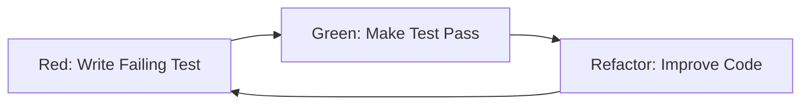
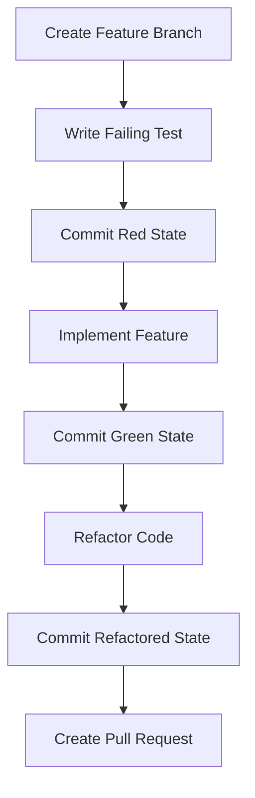

# Test-Driven Development (TDD) Approach

TDD is a development methodology where tests are written before the implementation code, following the Red-Green-Refactor cycle.

## The Red-Green-Refactor Cycle



### Red Phase: Write a Failing Test

Write the smallest possible test that fails for the right reason.

```typescript
describe('calculateTotal', () => {
    it('should return 0 for empty cart', () => {
        const result = calculateTotal([]);
        expect(result).toBe(0);
    });
});
```

### Green Phase: Make the Test Pass

Write the minimal code to make the test pass.

```typescript
function calculateTotal(items: CartItem[]): number {
    if (items.length === 0) {
        return 0;
    }
    return items.reduce((total, item) => total + item.price * item.quantity, 0);
}
```

### Refactor Phase: Improve the Code

Clean up the code while keeping tests green.

```typescript
function calculateTotal(items: CartItem[]): number {
    return items.reduce((total, item) => total + (item.price * item.quantity), 0);
}
```

## TDD Benefits

### Design Benefits
- Forces you to think about the interface before implementation
- Leads to more modular, testable code
- Encourages simple, focused designs
- Reduces over-engineering

### Quality Benefits
- High test coverage by design
- Tests serve as living documentation
- Immediate feedback on code changes
- Reduces debugging time

### Confidence Benefits
- Safe refactoring with comprehensive test suite
- Clear understanding of what the code should do
- Easier to maintain and extend code
- Fewer production bugs

## TDD Workflow

### 1. Start with a User Story
```typescript
// User Story: As a user, I want to calculate my cart total including tax
```

### 2. Write the First Test
```typescript
describe('CartCalculator', () => {
    it('should calculate total for single item', () => {
        const calculator = new CartCalculator();
        const items = [{ name: 'Book', price: 10, quantity: 1 }];
        
        const total = calculator.calculateTotal(items);
        
        expect(total).toBe(10);
    });
});
```

### 3. Run the Test (Red)
```bash
npm test
# Expected: Test fails because CartCalculator doesn't exist
```

### 4. Write Minimal Implementation (Green)
```typescript
class CartCalculator {
    calculateTotal(items: CartItem[]): number {
        return 10; // Hardcoded to make test pass
    }
}
```

### 5. Add More Tests to Drive Design
```typescript
it('should calculate total for multiple items', () => {
    const calculator = new CartCalculator();
    const items = [
        { name: 'Book', price: 10, quantity: 2 },
        { name: 'Pen', price: 5, quantity: 1 }
    ];
    
    const total = calculator.calculateTotal(items);
    
    expect(total).toBe(25);
});
```

### 6. Implement Real Logic (Green)
```typescript
class CartCalculator {
    calculateTotal(items: CartItem[]): number {
        return items.reduce((total, item) => total + (item.price * item.quantity), 0);
    }
}
```

### 7. Refactor for Quality
```typescript
class CartCalculator {
    calculateTotal(items: CartItem[]): number {
        return items.reduce((total, item) => total + this.getItemTotal(item), 0);
    }
    
    private getItemTotal(item: CartItem): number {
        return item.price * item.quantity;
    }
}
```

## Advanced TDD Patterns

### Test Data Builders
```typescript
class CartItemBuilder {
    private item: Partial<CartItem> = {};
    
    withName(name: string): CartItemBuilder {
        this.item.name = name;
        return this;
    }
    
    withPrice(price: number): CartItemBuilder {
        this.item.price = price;
        return this;
    }
    
    withQuantity(quantity: number): CartItemBuilder {
        this.item.quantity = quantity;
        return this;
    }
    
    build(): CartItem {
        return {
            name: this.item.name || 'Default Item',
            price: this.item.price || 0,
            quantity: this.item.quantity || 1
        };
    }
}

// Usage in tests
const expensiveBook = new CartItemBuilder()
    .withName('Expensive Book')
    .withPrice(100)
    .withQuantity(2)
    .build();
```

### Test Doubles (Mocks, Stubs, Spies)
```typescript
describe('OrderService', () => {
    it('should save order after calculating total', () => {
        const mockRepository = {
            save: jest.fn().mockResolvedValue({ id: 1 })
        };
        const orderService = new OrderService(mockRepository);
        
        const order = { items: [{ name: 'Book', price: 10, quantity: 1 }] };
        
        orderService.processOrder(order);
        
        expect(mockRepository.save).toHaveBeenCalledWith(
            expect.objectContaining({ total: 10 })
        );
    });
});
```

### Parameterized Tests
```typescript
describe('calculateDiscount', () => {
    const testCases = [
        { amount: 100, expectedDiscount: 10 },
        { amount: 500, expectedDiscount: 50 },
        { amount: 1000, expectedDiscount: 100 }
    ];

    testCases.forEach(({ amount, expectedDiscount }) => {
        it(`should calculate ${expectedDiscount} discount for ${amount} amount`, () => {
            const discount = calculateDiscount(amount);
            expect(discount).toBe(expectedDiscount);
        });
    });
});
```

## TDD Anti-Patterns to Avoid

### Testing Implementation Details
```typescript
// Focus on behavior, not implementation
it('should process payment successfully', () => {
    const result = paymentService.processPayment(paymentData);
    expect(result.success).toBe(true);
    expect(result.transactionId).toBeDefined();
    // Don't test internal method calls unless they're part of the contract
});
```

### Overly Complex Test Setup
```typescript
// Keep test setup simple and focused
describe('UserService', () => {
    let userService: UserService;
    
    beforeEach(() => {
        userService = new UserService();
    });
    
    it('should create user with valid data', () => {
        const userData = { name: 'John', email: 'john@example.com' };
        const user = userService.createUser(userData);
        expect(user.id).toBeDefined();
    });
});
```

## Integration with Development Workflow

### TDD with Git Workflow


### TDD with CI/CD
```typescript
// Jest configuration for TDD workflow
module.exports = {
    testMatch: ['**/__tests__/**/*.test.ts'],
    collectCoverageFrom: [
        'src/**/*.ts',
        '!src/**/*.d.ts'
    ],
    coverageThreshold: {
        global: {
            branches: 80,
            functions: 80,
            lines: 80,
            statements: 80
        }
    }
};
```

## Measuring TDD Success

### Quality Metrics
- Test coverage (focus on meaningful coverage, not just percentage)
- Defect rate in production
- Time to fix bugs
- Code complexity metrics

### Team Metrics
- Confidence in making changes
- Time spent debugging
- Feature delivery speed
- Code review efficiency

### Code Health Indicators
```typescript
// Well-tested code has clear interfaces
interface PaymentProcessor {
    processPayment(amount: number, method: PaymentMethod): Promise<PaymentResult>;
    validatePayment(paymentData: PaymentData): ValidationResult;
}

// Tests serve as documentation
describe('PaymentProcessor', () => {
    it('should process credit card payment successfully', () => {
        // Test clearly shows expected behavior
    });
    
    it('should reject payment with insufficient funds', () => {
        // Test documents error handling
    });
});
```